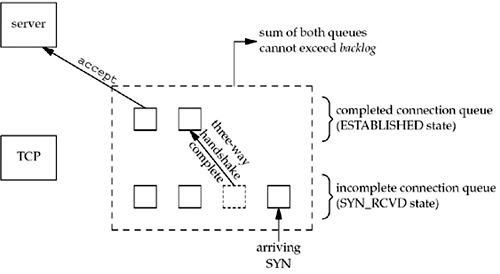
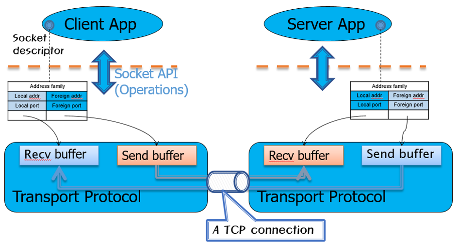

# Network Programming, Part 1

## Bytes and Bytesarray Objects
`bytes`: immutable sequences of single bytes
  - str method 거의 전부 적용 가능
> UTF-8 encoding 방식은 영문자(7-bit ASCII)는 그대로 1 byte로 표현된다. 그러나, 8-bit ASCII(>=128)나 muti-byte code들(한글 완성형 code, MS949 code, unicode 등)은 문자 당 2~4 byte로 변환된다.


```python
a = 'hello, 안녕'
b = a.encode('utf-8')
print(b)
print(b.hex())
print(len(b))  # number of bytes
print(type(b))
```

    b'hello, \xec\x95\x88\xeb\x85\x95'
    68656c6c6f2c20ec9588eb8595
    13
    <class 'bytes'>
    

`bytearray`: mutable counterpart to `bytes` objects


```python
ba = bytearray(a, 'utf-8')
ba.extend(b'korea')
ba[0] += 1
print(ba)
```

    bytearray(b'iello, \xec\x95\x88\xeb\x85\x95korea')
    

## First socket program - a client
Open a TCP socket:


```python
import socket
s = socket.socket(socket.AF_INET, socket.SOCK_STREAM)  # create a TCP socket object
print(s)
print(type(s))
```

    <socket.socket fd=45, family=AddressFamily.AF_INET, type=SocketKind.SOCK_STREAM, proto=0, laddr=('0.0.0.0', 0)>
    <class 'socket.socket'>
    

Connect the echo server:
- connection이 성공하면, connected socket은 local address와 remote(or foreign) address를 기억한다. 이후 server address를 적을 필요 없다.


```python
s.connect(('np.hufs.ac.kr', 7))    # connect to echo server
print(s)
```

    <socket.socket fd=45, family=AddressFamily.AF_INET, type=SocketKind.SOCK_STREAM, proto=0, laddr=('203.253.70.30', 53514), raddr=('203.253.70.30', 7)>
    

> 주의: 보내는 메시지는 UTF-8 code로 encoding, 받은 메시지는 UNICODE로 decoding
- TCP는 byte-stream protocol이다. 해야 한다. (UTF-8은 multi-byte code를 byte stream으로 *serialize*)
- Unicode와 같은 multi-byte code를 직접 보내면 위험하다.  
- 인터넷 대다수 protocol의 문법은 원래 ASCII로 사용을 전제로 개발되었고, web에서도 UTF-8가 표준

Send/Receive messages using the connected socket


```python
msg = 'Hello, 대한민국!'
s.send(msg.encode('utf-8'))        # send in bytes or bytearray type
```


    20


```python
reply = s.recv(1024)
print(type(reply))
print(reply.decode('utf-8'))       
```

    <class 'bytes'>
    Hello, 대한민국!
    

Close the socket:
- cause to send FIN (request to close the TCP session)
- no more use this socket


```python
s.close()
```

### Identify a Processes on Internet
A process on the Internet is identified by (*host*, *port*)
- Host(machine) by 32-bit IP address
  - dotted decimal notation: `'203.253.70.32'`
  - domain name: `'mclab.hufs.ac.kr'`
  - `'localhost' == '127.0.0.1'`
- Process in the host by 16-bit port number
  - well-known port: 0 ~ 1023
    - reserved by standard protocols
    - entifies the standard service(server process)
  - registered port: 1024 ~ 49151
  - dynamic port: 49152 ~ 65535 (dynamically assigned for clients)

### Client-Server Model
Internet에서 대부분의 application이나 application protocol은 client-server model로 구현되어 있다. 이 모델은 역할/기능이 분리되어 있어 구현이 용이하다. (Peer-to-peer model도 있다.)

Client: server에게 서비스를 request한다. (서비스를 제공하지 않는다.)

Server: client들의 request를 받아 response를 돌려 준다.
- always on: 보통 항상 실행되고 있다. - daemon process로 
- 고정 IP가 필요 (client가 server가 설치된 host를 idtify할 수 있도록)
- 여러 client들의 request들을 동시에 받고 처리할 수 있어야 한다.

## Socket API
- 가장 널리 쓰이는 Communication API
- 여러 protocol suite에 대해 generic API 제공
- Transport, network, link layer의 서비스를 받을 수 있는 API도 제공!

Socket address: (*host*, *port*)

Connected socket address: ((*local host*, *local port*), (*remote host*, *remote port*))


### Create socket objects
###### Create socket object:
```Python
s = socket.socket(socket.AF_INET, socket.SOCK_STREAM) # TCP socket for IPv4
```
참고: Create UDP socket object:
```Python
s = socket.socket(socket.AF_INET, socket.SOCK_DGRAM)  # UDP socket for IPv4
```

### Establishing TCP Connection
Connection을 설정하는 3-way handshake 과정을 거친다.


#### Client's perspectives
###### Connect server with address (host, port):
```Python
s.connect((host, port))
```

- connect()가 return되기까지 RTT가 소요된다.
- connect()가 fail되는 경우
  - No such server process
  - host/network unreachable
  - 3번 retry하기 때문에 fail임을 아는데 시간 많이 걸린다. (75초)
  - fail되면 socket을 close해야

#### Server's perspectives:
###### Set this socket address with address (host, port):
```Python
listen_sock = socket.socket(socket.AF_INET, socket.SOCK_STREAM)
listen_sock.bind((host, port)): 
```
> host는 여러개의 IP address를 가질 수 있다. 예를 들어, 203.253.70.33(또는 np.hufs.ac.kr), 127.0.0.1(또는 localhost). 사실, IP address는 host에게 부여되는 것이 아니라, host의 network interface(or network host)에 부여된다. 

> host가 `''`이면 host의 가진 모든 interface에 도착하는 connection request를 받아 들이도록 설정하겠다는 뜻이다.

###### Convert this socket to the listening socket :
```Python
listen_sock.listen(number)
```

> 이 소켓은 데이터 교환용이 아니라, client가 요청한 connection을 받아 들이는 용도로만 사용된다.

> 하나의 connection을 완료하려면, 적어도 RTT 시간이 걸린다. 그동안에 또 다른 connection request(SYN)가 많이 도착할 수 있으니 `number` 만큼의 connection을 수용하는 queue를 할당하라는 의미다. (실제로 시스템 마다 할당하는 수는 다를 수 있다.)



###### Accept a connection request:
```Python
s, addr = listen_sock.accept()
```

> connection이 완료된 queue에서 connected socket과 client address를 가져온다.
없다면, accept는 blocked된다.

### Data Exchange
Full duplex, byte stream transmission (record boundary가 없다.)


###### Put the msg into TCP(socket) send buf: (성공적으로 저장한 byte 수를 return)
```Python
n_sent = s.send(msg)
```

- Blocking mode(default)에서는 msg 전부가 send buffer에 저장되어야 return한다.
  - buffer space가 모자라면 block되어 대기하다 모두 저장했을 때 return
- 참고: Non-blocking mode에서는 가용한 buffer 크기 만큼만 send buffer에 저장할 수 있다. 따라서, 저장하기 성공한 byte 수가 return된다.

> 주의: send가 return되었다 해서 상대방에게 전달된 것은 아니다. TCP가 독립적이며 자율적으로 send buffer의 내용을 segment로 쪼개서 보내게 된다.

> Q. 내가 1,000 메시지를 보냈다 하자. 상대 측에서 recv했을 때 받은 메시지가 같은 1,000 byte일까?

###### msg 전부를 send buffer에 저장하기 할 떄까지 계속 send(): 
```Python
n_sent = s.sendall(msg): 
```
> Non-blocking socket에서도 메시지 전체를 확실히 보낼 수 있다.

######  Get some bytes(<=bufsize) from the TCP recv buf:
```Python
msg = s.recv(bufsize): 
```

> Empty byte(`b''`)이 return됨은 상대가 보낸 FIN(즉, 상대가 더 이상 보낼 것이 없어 종료하자는 신호)이 도착했음을 의미한다. 

> recv buffer가 비어 있으면, 당연히 block된다. (Non-blocking mode에서는 exception 발생)


### Closing TCP connection


close TCP connection and the socket
```Python
s.close()
```

> - TCP send buffer에 보낼 것이 있으면 모두 send
- close TCP connection: TCP sends FIN segment
  - 단, 이 socket을 다른 process와 share하고 있다면 FIN을 보내지 않음
- close된 socket을 가지고 더 이상 send, recv 할 수 없다.

Terminate one direction (half closing)
```Python
s.shutdown(how): 
```

> how:
- `socket.SHUT_WR`: 무조건 FIN을 보내고, 이후 send 금지. recv는 가능하다.
- `socket.SHUT_RD`: recv 금지

> shutdown(socket.SHUT_WR) 후에 socket이 close된 것은 아니므로 recv할 수 있다.

> 보통 마지막 request message를 보낸 후, s.shutdown(socket.SHUT_WR)로 상대에게 더 보낼 것이 없음을 알린다. 상대가 보낸 메시지가 network delay 때문에 나중에 도착할 수 있기 때문에 상대가 종료를 알릴 때까지(즉, FIN이 도착할 때까지) 이후 메시지를 수신할 수 있다. - client 측에서 보통 사용함
